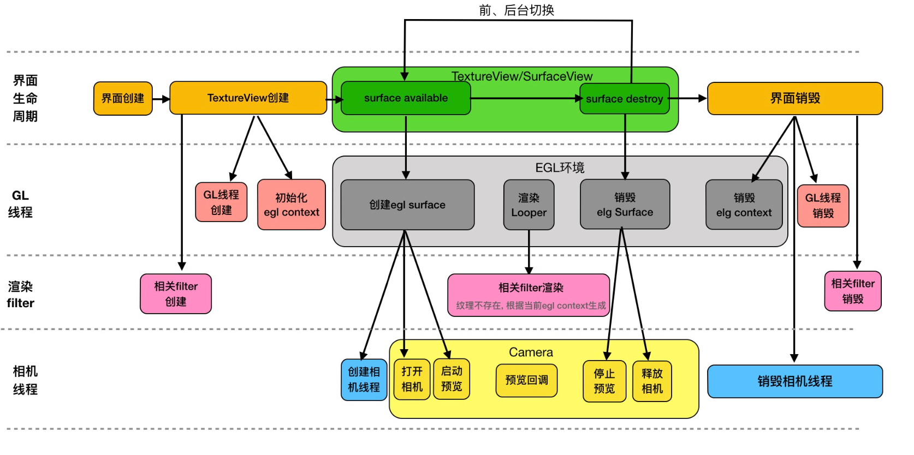
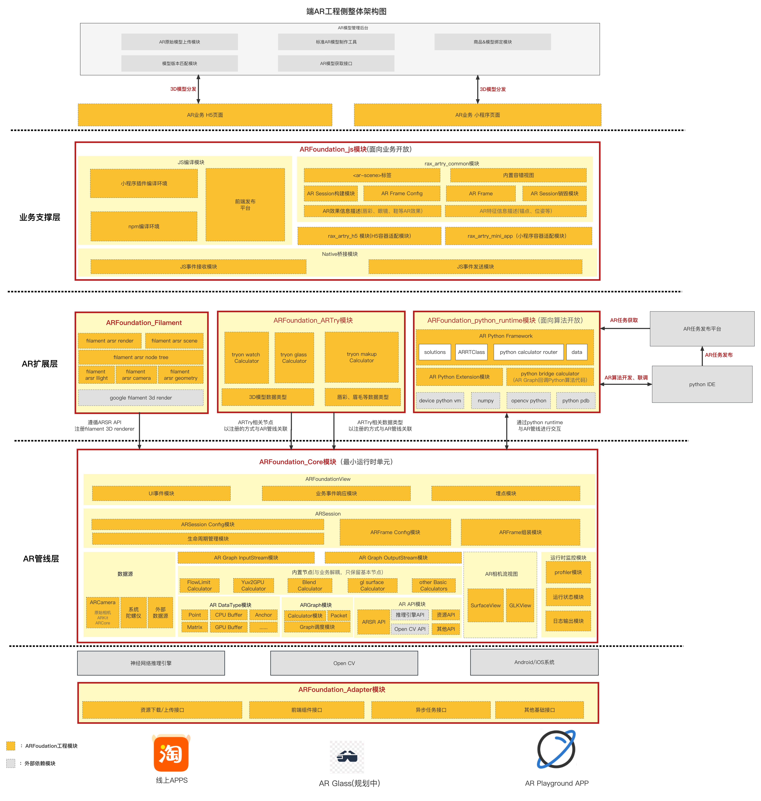
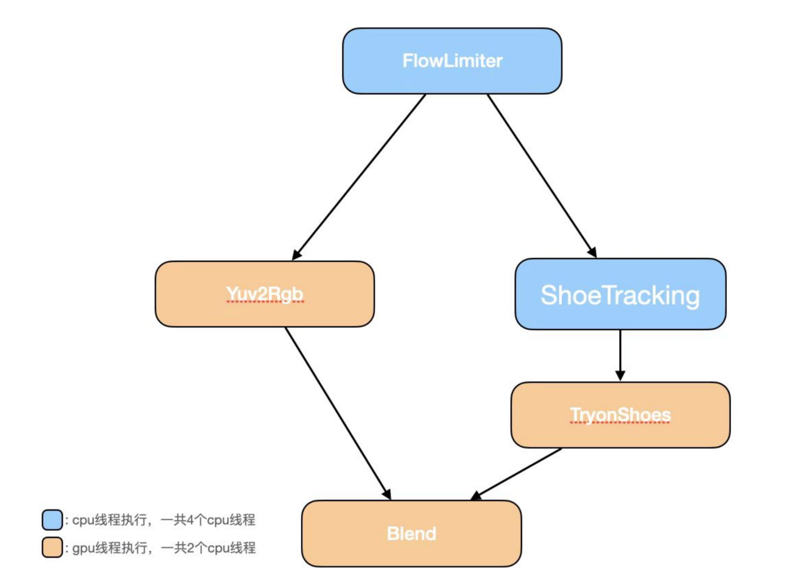
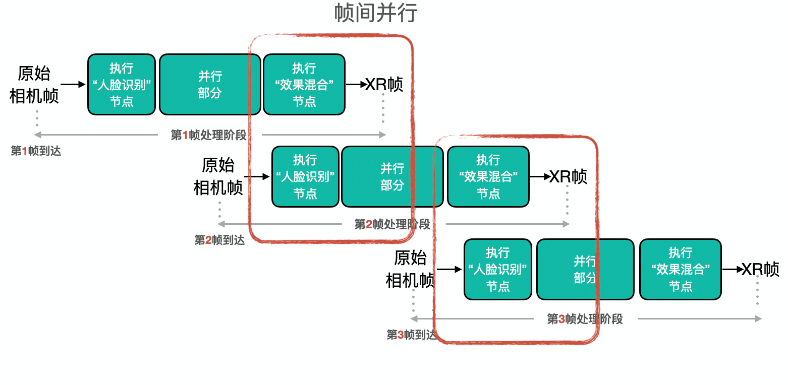
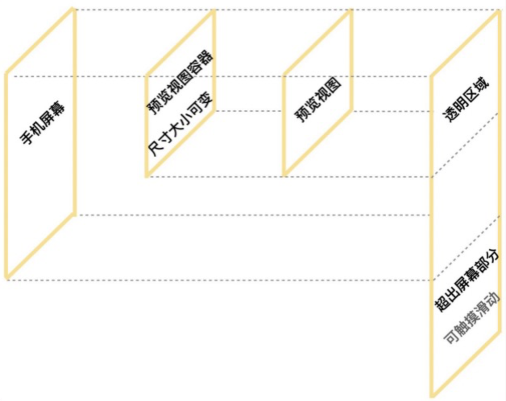

 

     <h1>张杭</h1>
     

         
             
             13718562498
         
         ·
         
             
             407376249@qq.com
         
     

 

 ##  个人信息 

 - 男，1990 年出生

 - 求职意向：Android研发工程师(AR、OpenGL方向)，Android Framework工程师，渲染引擎工程师

 - 工作经验：10+ 年

 - 期望薪资：面议

 - 自我评价：

   - 8年Android开发经验；丰富的Android架构经验；

   - 熟悉Android源码，理解相机、SuraceView等相关原理；属性JVM的部分流程；

   - 拥有完整的AR项目开发经验，熟悉ARKit/ARCore、CV、渲染等AR相关技术；

   - 熟悉OpenGL ES编程，拥有GPU项目级开发经验；

   - 掌握Java编程，拥有C++项目级的编程经验；

     

##  教育经历

- 学士/本科，华中师范大学(211)，信息管理与信息系统转头，2008.9~2012.7

- 通过了 CET4 英语等级考试

  

##  工作经历

- **字节跳动，视频架构-云渲染，Android工程师，2022.12~至今**

​		

- **阿里巴巴，大淘宝技术-端智能，Android工程师，2017.11~2022.12(5年)**

   - 对手机淘宝跨端**AR**工程架构进行整体负责，包括架构整体的搭建与演进；

   - Android侧电商 + AR业务的研发与集成；

   - 对手淘扫一扫模块进行日常迭代与维护；

      

- **小米，MIUI部门，Android工程师，2016.7~2017.10**

   负责变色龙广告SDK的研发与集成

   该SDK是一款通过配置线上广告视图的模版，动态生成广告界面的SDK，为小米浏览器、小米日历、小米安全中心等10+小米APP提供广告功能，支撑整个MIUI系统近80%的端侧广告业务。

   

- **搜狐焦点，房产业务部，Android工程师，2015.7~2016.7**

   负责搜狐房销宝APP中相关功能Android端的研发与集成。

   

- **58同城，到家业务部⻔，Android工程师，2014.7~2015.7** 

   负责58到家APP中相关功能Android端的研发与集成。

   

- **亚信联创科技，软件工程师，2012.7~2014.7** 

   负责河南移动CRM系统的研发与维护。

   

##  项目经历

- **Android EGLSession项目**

  负责设计整个模块以及代码开发。

  

  参考GLSurfaceView源码，重写OpenGL渲染线程，并以Sesssion的概念对渲染线程进行封装、抽象。

  此模块的核心功能是ELG配置管理、渲染线程生命周期管控; 

  

  与GLSurfaceView相比，此模块具有以下三个特点:

  + 渲染线程基于HandlerThread，消息驱动自带Looper;

  +  增加了surface destroy生命周期回调; 

  + EGL配置与具体视图解耦，可自由与SurfaceView、TextureView甚至普通View进行上屏、离屏渲染;

    

  EGLSession模块与相机场景的结合可通过下图所示:

  

- **ARTry跨端工程架构项目**

  ARTry工程架构支持了手淘APP中当时**所有的AR业务**。

  

​		本人负责整体工程架构从0到1的设计及持续演进。

​        ARTry跨端工程架构具体的优势是高效研发与高性能。

​        对于高效研发，主要解决了业务侧与算法侧彼此技术栈不同的问题，核心策略是将AR场景的开发者分为以下两类用户：

​         1. **AR业务研发者**，以typescript语言为核心语言，封装AR Sesssion API，屏蔽AR场景的实现细节，降低业务研发者对AR场景的理解成本；

​         2. **AR算法研发者**，以python语言作为核心语言，封装AR Graph概念，为算法研发者屏蔽底层不同渲染引擎以及整体工程细节；

  

​		对于高性能方面，核心策略是利用多线程调度技术，从**AR帧间并行**与**AR帧内并行**两种维度去提升具体AR场景的FPS。

​		在具体的实践中，AR试鞋场景中，通过AR帧间并行，整体FPS从12提升到18左右。

   

​         **该项目更多的架构描述及技术细节，可参考附录。**

* **AR放置业务场景项目**

    负责整个AR放置业务的研发及Android端集成工作。

  

​         将AR放置功能（例如，将冰箱、洗衣机等3D模型放置在相机画面中识别到的AR平面之上），落地到天猫APP之中。

​         此业务场景，涉及以下4个核心功能：

​         1. 接入ARCore/ARKit，对相机画面进行实时平面检测与追踪，并得到平面对应的位置与大小；

​         2. 通过OpenGL ES，从解析平面Mesh，并对其进行3D渲染，让用户感知平面所在；

​         3. 对接渲染引擎，抽象渲染API，落地冰箱、洗衣机等3D模型的渲染能力；

​         4. 通过3D坐标、3D向量等图形学基础知识，实现对冰箱、洗衣机等3D模型拖拽、缩放等交互功能；

##  技能清单

- ★★★ Java、Android
- ★★☆ OpenGL、图形学基础、C++
- ★☆☆ Unreal引擎、python、typecript

##  附录：ARTry架构设计详细说明

ARTry详细架构图如下所示：

整个框架**从下到上**分为三层：

* **AR管线层**

  AR管线层有三个作用：

  1. 为**业务研发者**封装AR Session API；
  2. 为**算法研发者**封装AR Graph API：将需要实现的AR场景，抽象成一个DAG(有向无环图)，Graph中的每一个Calculator Node都对应一种AR能力；
  3. 以串、并行混合方式运行AR场景，提升帧率，以达到实时性的目的；

​        

​        其中，AR管线层通过**帧内并行、帧间并行**两种方式，在相同时间内，提升AR帧生成的个数，从而提升整体AR场景的FPS。

​		帧内并行：

​		

​				

​				帧间并行：

​				

* **AR扩展层**

  AR的本质是将虚拟(数字)内容，"自然"的融入到现实世界之中，达到身临其境的"增强现实"的目的。

​		不同的虚拟内容及其展示、融入的方式，可抽象成不同的AR能力；而不同的AR能力可组成不同的AR场景。

​		AR扩展层的作用，是为搭建不同的AR场景，提供不同的、模块化的AR能力。

​		具体的AR能力，可分为以下两类：

​		1. **识别**：对现实世界的理解，核心为CV领域；

​        2. **渲染**：对虚拟内容的展示，核心为CG领域；

​		无论是哪一种类型的AR能力，皆可将之封装为AR Calculator Node，进行AR能力的扩展。

* **AR业务支撑层**

  核心为ARFoundation_JS模块，90%的ARTry业务，都是以前段JS页面为业务载体。

​		

​		此模块，以typescript实现，降低前端业务研发者接入AR能力的门槛与成本。

​		同时，整个AR页面，采用"动静态视图分离"机制：

​		