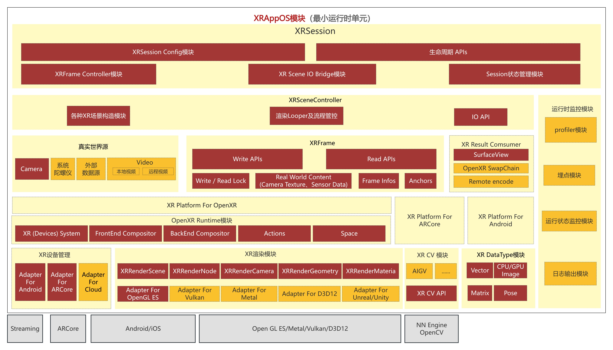

 

     <h1>张杭</h1>
     

         
             
             13718562498
         
         ·
         
             
             407376249@qq.com
         
     

 

 ##  个人信息 

 - 男，1990 年出生

 - 求职意向：Android研发工程师(元宇宙、OpenGL方向)，Android Framework工程师，渲染引擎工程师

 - 工作经验：10+ 年

 - 期望薪资：面议

 - 自我评价：

   - 8年+Android开发(Camera、视频直播串流、Surface、Framework)经验；丰富的架构经验；

   - 熟悉C++语言；拥有完整的基于cmake跨平台项目经验，熟悉Android NDK，拥有Win32应用开发经验；

   - 熟悉OpenGL ES、Vulkan编程；熟悉GLSL脚本；熟悉MVP、3D向量等图形学基础知识；拥有GPU项目级开发经验；

   - 拥有完整的XR项目开发经验；

     - 熟悉ARCore；
     - 熟悉OpenXR，阅读过monado源码拥有runtime开发经验;
     - 熟悉ERP、CAP/EAC等常见的VR场景中全景投影原理；
     
     
     

##  教育经历

- 学士/本科，华中师范大学(211)，信息管理与信息系统专业，2008.9~2012.7

- 通过了 CET4 英语等级考试

  

##  工作经历

- **字节跳动，视频架构-云渲染，Android工程师，2022.12~至今**
  
   - XRAppOS工程架构整体设计与演进；
   
      - XRAppOS是一款以拓展XR业务场景，整合XR多栈技术为目标的架构系统；
   
      - 整个架构用以支撑团队大空间VR、全景视频、AR特效等偏向于创新的业务探索与落地；
   
      - 内置自研**openxr runtime库**，负责交互、合成器2大核心模块的开发；
   
      - 内置自研**渲染引擎**，具有两大核心能力：
   
        - 渲染管线动态化；
   
        - 统一渲染API(可适配Unreal等主流游戏引擎，OpenGL、D3D11、Vulkan等主流图形库)；
   
      - 申请了1项Android平台共享纹理相关的**专利**；
   
      - 申请了1项关于Open XR26个手势关节数据压缩相关的**专利**；
   
         
   
   - 云游戏串流业务日常迭代；
   
      - 基础架构建设
   
         - C++跨端自研埋点上报SDK；
            - 基于cmake实现跨端编译;
            - 基于MMAP实现持久化能力，同时通过JNI、nativeapi适配Android、Windows、鸿蒙三大平台；
            - 整体埋点上报成功率达到99.99%(去除主动丢弃);	可稳定支撑日均千万量级的上传埋点事件；
         - aar auto CI/CD链路搭建；
            - 基于gradle + kotlin，从0到1搭建auto CI/CD链路；
            - 整个编译链路兼容cp or cg、线上or 线下、有无插件 **8 种**flovar的编译产物，具有一定的复杂性；
            - 通过javassist、fat-aar等开源sdk，完成dex文件修改、aar合并等auto CI/CD核心功能；
   
      - 基于Android Framework的项目开发
   
         - 基于**HAL**的Virtual Device模块开发，实现云端相机流、音频流注入功能；
         - AOSP系统级推流APP游戏启动耗时优化;
            - 以C++ elf文件替换游戏启动shell脚本，降低游戏启动耗时(2s-->1s左右);
            - elf文件直接依赖AOSP源码中的binder头文件，项目产物与AOSP中system/bin中可执行文件类似;
   
      - Android/Windows端拉流SDK迭代演进
   
         - 基于bytertc及操作系统本身，实现云游戏画面拉流 & 游戏交互两大核心功能；
   
           
   

- **阿里巴巴，大淘宝技术-端智能，Android工程师，2017.11~2022.12(5年)**

   - 对手机淘宝跨端**AR**工程架构进行整体设计与演进；

     

   - 基于AR工程架构，支撑电商 + AR领域的业务需求；

     - 与算法同学共同实现了AR美妆、AR试鞋、AR试表、AR试眼镜、AR家电、数字藏品6大核心业务；

       

   - 对手淘扫一扫模块进行日常迭代与维护；

      

- **小米，MIUI部门，Android工程师，2016.7~2017.10**

   负责变色龙广告SDK的研发与集成

   该SDK是一款通过配置线上广告视图的模版，动态生成广告界面的SDK，为小米浏览器、小米日历、小米安全中心等10+小米APP提供广告功能，支撑整个MIUI系统近80%的端侧广告业务。

   

- **搜狐焦点，房产业务部，Android工程师，2015.7~2016.7**

   负责搜狐房销宝APP中相关功能Android端的研发与集成。

   

- **58同城，到家业务部⻔，Android工程师，2014.7~2015.7** 

   负责58到家APP中相关功能Android端的研发与集成。

   

- **亚信联创科技，软件工程师，2012.7~2014.7** 

   负责河南移动CRM系统的研发与维护。

   

##  核心项目

- **XRAppOS**

  整体架构分为三层：

  1. Session层：对外API暴露、生命周期管控；
  2. Scene层   ：XR场景构建、运行；
  3. System层 ：openxr runtime，OS、硬件设备封装；

  

  

- **自研OpenXR Runtime**

  此项目是XRAppOS架构中**最重要**的子模块。

  目前，已经在云Windows平台上落地；云、端Android平台正在落地中。

  整体架构：

  

  

  自研OpenXR Runtime包含2个核心模块：

  1. 交互模块，基于InteractionProfile封装了Session、Action、Device之间的映射关系;

     

  2. 合成模块(落地中)，基于Monado的核心思想，将合成器分为以下2类：

     1. FrontEnd Compositor，基于OpenGL ES实现，与OpenXR APP运行同一进程；
     2. BackEnd Compositor，基于Vulkan实现，既可与OpenXR APP运行同一进程，也可运行在独立进程中；

  ​       其中FrontEnd Compositor与BackEnd Compositor基于共享纹理(Android平台下基于AHardwareBuffer)进行通信。

  

​              合成模块的整体架构，基于OpenXR的合成概念进行落地：

​				

- **基于HAL的Virtual Device项目**

​		云游戏业务中，会将AOSP镜像移植至云端设备中；为了使运行在云端APP能够正常使用相机、麦克风等功能，需要将本地设备的相机画面或者麦克风音频数据注入到云端Android Framework之中。

​		Virtual Device模块是实现这类功能的关键，此模块包含2个核心功能：

  1. 基于HAL，向Android Framework注册Virtual Camera、Virtual Mic等虚拟设备；

  2. 接收端侧真实设备传输过来的数据流，并通过共享内存(ashmem类型的hidl memory)的方式转发给Android Framework;

     整体架构如下所示：

     

- **ARTry跨端工程架构项目**

  ARTry工程架构支持了手淘APP中当时**所有的AR业务**。

  

​		本人负责整体工程架构从0到1的设计及持续演进。

​        ARTry跨端工程架构具体的优势是高效研发与高性能。

​        对于高效研发，主要解决业务侧与算法侧技术栈不同的问题，核心策略是将AR场景的开发者分为两类用户：

​         1. **AR业务研发者**，以typescript语言为核心语言，封装AR Sesssion API，屏蔽AR场景的实现细节，降低AR场景的理解成本；

​         2. **AR算法研发者**，以python语言作为核心语言，封装AR Graph概念，为算法研发者屏蔽**整体工程细节**；

  

​		对于高性能，核心策略是利用多线程调度技术，从**帧间并行**与**帧内并行**两种维度去提升具体AR场景的FPS。

​		具体实践: AR试鞋场景中，通过AR帧间并行，整体FPS从12提升到18左右。

   

​         **该项目更多的架构描述及技术细节，可参考附录。**

* **AR放置业务场景项目**

    负责整个AR放置业务的研发及Android端集成工作。

  

​         将AR放置功能（例如，将冰箱、洗衣机等3D模型放置在相机画面中识别到的AR平面之上），落地到天猫APP之中。

​         此业务场景，涉及以下4个核心功能：

​         1. 接入ARCore/ARKit，对相机画面进行实时平面检测与追踪，并得到平面对应的位置与大小；

​         2. 通过OpenGL ES，从解析平面Mesh，并对其进行3D渲染，让用户感知平面所在；

​         3. 对接渲染引擎，抽象渲染API，落地冰箱、洗衣机等3D模型的渲染能力；

​         4. 通过3D坐标、3D向量等图形学基础知识，实现对冰箱、洗衣机等3D模型拖拽、缩放等交互功能；

##  技能清单

- ★★★ Java、Android
- ★★☆ OpenGL、图形学基础、C++
- ★☆☆ Unreal引擎、python、typecript

##  附录：ARTry架构设计详细说明

ARTry详细架构图如下所示：

整个框架**从下到上**分为三层：

* **AR管线层**

  AR管线层有三个作用：

  1. 为**业务研发者**封装AR Session API；
  2. 为**算法研发者**封装AR Graph API：将需要实现的AR场景，抽象成一个DAG(有向无环图)，Graph中的每一个Calculator Node都对应一种AR能力；
  3. 以串、并行混合方式运行AR场景，提升帧率，以达到实时性的目的；

​        

​        其中，AR管线层通过**帧内并行、帧间并行**两种方式，在相同时间内，提升AR帧生成的个数，从而提升整体AR场景的FPS。

​		帧内并行：

​		

​				

​				帧间并行：

​				

* **AR扩展层**

  AR的本质是将虚拟(数字)内容，"自然"的融入到现实世界之中，达到身临其境的"增强现实"的目的。

​		不同的虚拟内容及其展示、融入的方式，可抽象成不同的AR能力；而不同的AR能力可组成不同的AR场景。

​		AR扩展层的作用，是为搭建不同的AR场景，提供不同的、模块化的AR能力。

​		具体的AR能力，可分为以下两类：

​		1. **识别**：对现实世界的理解，核心为CV领域；

​        2. **渲染**：对虚拟内容的展示，核心为CG领域；

​		无论是哪一种类型的AR能力，皆可将之封装为AR Calculator Node，进行AR能力的扩展。

* **AR业务支撑层**

  核心为ARFoundation_JS模块，90%的ARTry业务，都是以前段JS页面为业务载体。

​		

​		此模块，以typescript实现，降低前端业务研发者接入AR能力的门槛与成本。

​		同时，整个AR页面，采用"动静态视图分离"机制：

​		